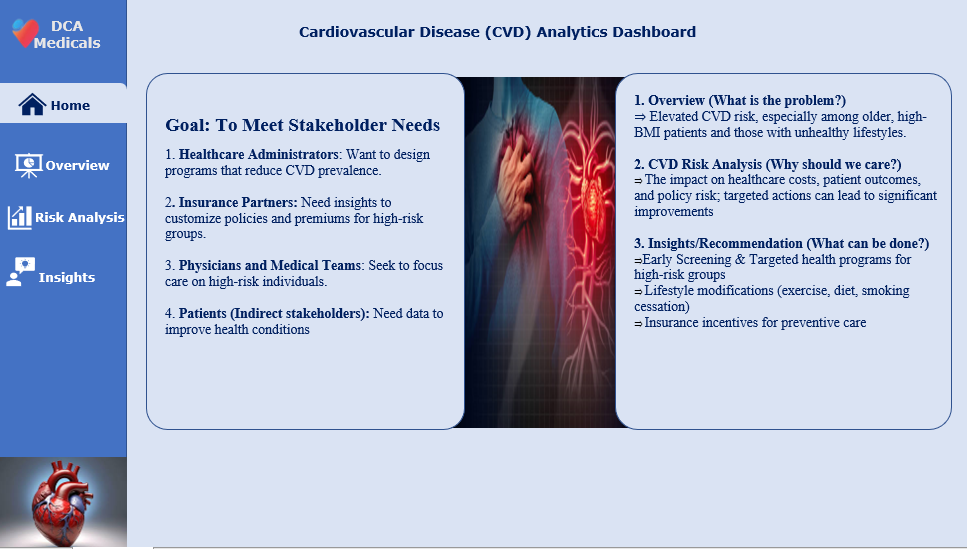
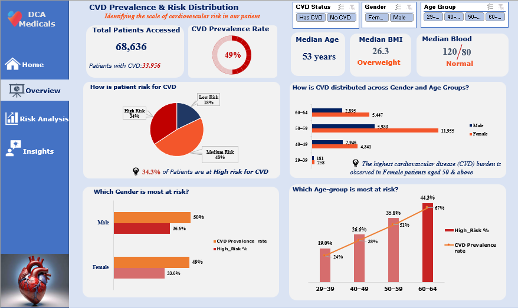
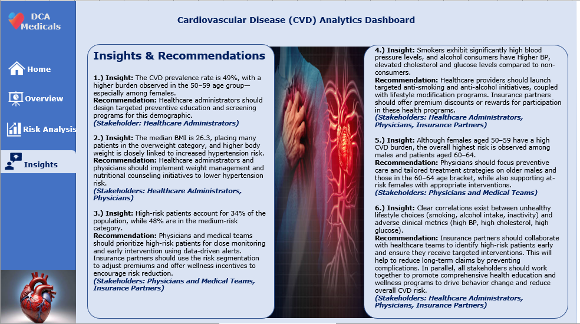

# Cardiovascular Disease (CVD) Risk Analysis

## Business Problem

Cardiovascular disease (CVD) is a leading public health concern, yet many healthcare stakeholders lack clear insights to **identify high-risk patients early** and implement targeted prevention strategies.
This limits proactive care, efficient resource allocation, and data-driven insurance policy design.

## Target Audience
-	Technical and Non-technical Healthcare stakeholders

## Objective

* Identify high-risk CVD patient groups using demographic and clinical data
* Analyze the impact of lifestyle factors on cardiovascular risk
* Deliver actionable insights for healthcare and insurance stakeholders

**Key KPIs**

* CVD prevalence rate
* Risk distribution by age and gender
* BMI and hypertension relationship
* Blood pressure, cholesterol, and glucose trends

## Dataset

* **Source:** [Kaggle](https://www.kaggle.com/datasets/sulianova/cardiovascular-disease-dataset)
* **Key Fields:**
  * Age, Gender
  * BMI
  * Blood Pressure, Cholesterol, Glucose
  * Lifestyle factors (Smoking, Alcohol use, Physical activity)
  * CVD diagnosis / risk indicators

## Tools Used
* Microsoft Excel
  * Power Query
  * Pivot Tables
  * Power Pivot (Data Modellling & KPI measures)

## Analysis Approach

* Cleaned and transformed data using Power Query
* Built relationships and KPI measures with Power Pivot
* Analyzed demographic, lifestyle, and clinical risk patterns
* Designed an interactive Excel dashboard with slicers and pivot charts

## Key Insights

* **49% of assessed patients had CVD**, with the highest burden among **women aged 50–59**
* **Males and individuals aged 60–64** showed the highest overall CVD risk
* **Overweight patients** exhibited a strong link to hypertension
* **Smokers and alcohol consumers** recorded elevated blood pressure, cholesterol, and glucose
  

## Recommendations

* **Healthcare Administrators:** Implement targeted prevention programs for high-risk demographics
* **Physicians & Medical Teams:** Prioritize proactive screening and early intervention for patients aged **50+**
* **Insurance Partners:** Apply risk-based segmentation to adjust premiums and introduce wellness incentives

  

## Deliverables
🔗 **Interactive Dashboard:** [Link](https://docs.google.com/spreadsheets/d/125KFqe5nGZ3CQBKdqDMTxzGhTQ08sB5M/export?format=xlsx&ouid=118395754396243334299&rtpof=true&sd=true)

🔗 **Video walkthrough of dashboard insights:** [Link](https://www.linkedin.com/posts/chukwuemekajoanc_data-healthcare-dashboard-activity-7312190455914364928--HVf?utm_source=share&utm_medium=member_desktop&rcm=ACoAABc4f74BKaEgLa0swbbXMdX_VWsk651hVGA)

## Skills Demonstrated
- Health data analysis
- Risk segmentation
- KPI design using Power Pivot
- Data modeling in Excel
- Stakeholder-focused storytelling

